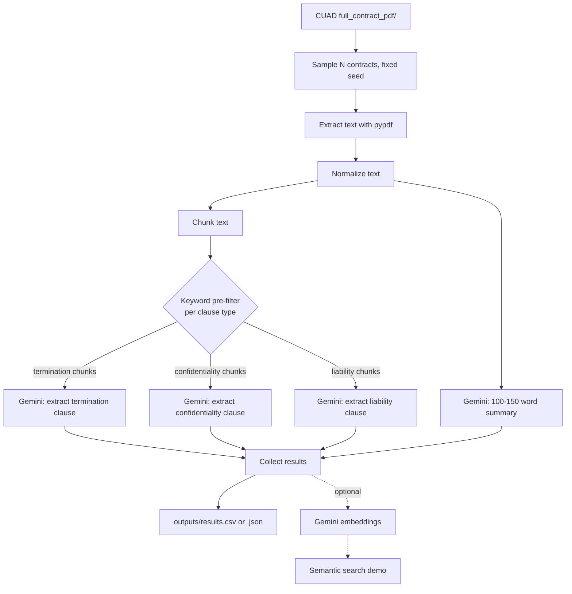

# CUAD Clause Extraction & Summarization

This repository implements an end-to-end pipeline for the AI Intern take-home assignment. It loads a subset of CUAD contracts, extracts contract text from PDFs, runs LLM-based clause extraction for termination, confidentiality, and liability clauses, generates a concise contract summary, and writes the results to a CSV file.

## What this project delivers

- A reproducible Python pipeline for processing a 50-contract subset from CUAD
- Clause extraction for three clause types: termination, confidentiality, liability
- A contract summary of 100–150 words for each contract
- An output CSV with the required shape: `contract_id`, `summary`, `termination_clause`, `confidentiality_clause`, `liability_clause`
- A bonus semantic-search demo over extracted clauses

## Setup

```bash
python -m venv .venv
# macOS/Linux:
source .venv/bin/activate
# Windows PowerShell:
.\.venv\Scripts\Activate.ps1
pip install -r requirements.txt

cp .env.example .env
# then edit .env and add your API key
```

The project supports both Groq and Gemini providers via environment variables. The default example uses Groq.

## Setup

```bash
python -m venv .venv
# macOS/Linux:
source .venv/bin/activate
# Windows PowerShell:
.\.venv\Scripts\Activate.ps1
pip install -r requirements.txt

cp .env.example .env
# then edit .env and add your GEMINI_API_KEY (get one at https://aistudio.google.com/apikey)
```

### Getting the dataset

CUAD isn't bundled in this repo (it's ~380MB). Download it from the
[Atticus Project site](https://www.atticusprojectai.org/cuad) or the
[GitHub mirror](https://github.com/TheAtticusProject/cuad), unzip it, and you should
end up with a `full_contract_pdf/` folder containing the contract PDFs, organized
into sub-folders by category. Point `--pdf_dir` at that folder — the script will
recursively find every PDF underneath it and randomly sample from there.

Expected folder structure:

```text
data/
  full_contract_pdf/
    Part_I/
      ...
    Part_II/
      ...
```

```
data/
  full_contract_pdf/
    Part_I/
      ...
    Part_II/
      ...
```

## Running it

```bash
python main.py --pdf_dir data/full_contract_pdf --n_contracts 50 --output outputs/results.csv
```

Args:
- `--pdf_dir` — path to the folder of contract PDFs (required)
- `--n_contracts` — how many unique contracts to process (default 50)
- `--output` — `.csv` or `.json` (default `outputs/results.csv`)
- `--seed` — random seed for reproducible sampling (default 42)
- `--model` — override the model name for the selected provider
- `--reset_output` — delete the existing output file before a fresh run

Expected output columns: `contract_id`, `summary`, `termination_clause`, `confidentiality_clause`, `liability_clause`.
An example of the expected row structure is in `outputs/sample_output.csv`.

### Bonus: semantic search over extracted clauses

Once you've got `outputs/results.csv`, you can search across every extracted clause
by meaning rather than keyword:

```bash
python search_demo.py --results outputs/results.csv --query "cap on damages"
```

This embeds every extracted clause with Gemini's embedding model and returns the
closest matches by cosine similarity — e.g. a query like "cap on damages" will
surface liability clauses phrased totally differently ("aggregate liability shall
not exceed...", "in no event shall either party be liable for more than...").

## Approach

**1. Load & preprocess** (`src/data_loader.py`, `src/preprocess.py`)
PDFs are sampled (reproducibly, via a fixed seed) and text is pulled out with `pypdf`.
Extracted text from PDFs is rarely clean — line-wrap hyphens split words in half,
page numbers/headers get mixed into the body, whitespace is inconsistent — so
there's a normalization pass before anything touches the LLM.

**2. Clause extraction is keyword-filtered before it's LLM-filtered** (`src/extraction.py`)
Contracts can run 20-40+ pages. Sending the whole thing to the LLM for every clause
type is wasteful and slow. Instead, the contract is chunked, and for each clause
type (termination / confidentiality / liability) a cheap keyword pre-filter picks
out the chunks that plausibly contain it (e.g. "terminat", "indemnif", "confidential").
Only those chunks get sent to Gemini, with a one-shot example in the prompt showing
the expected JSON shape and a quick sense of what a good extraction looks like. If no
chunk matches the keywords, we skip the LLM call entirely and mark the clause as
not found — this alone cuts token usage substantially on longer contracts.

**3. Summarization** (`src/summarization.py`)
A separate prompt asks for a 100-150 word summary covering purpose, obligations,
and notable risks/penalties. This uses the first ~12k characters of the contract,
which in practice covers the recitals and main obligations sections for most CUAD
contracts — full-document summarization for outlier long contracts is a known
limitation (see below).

**4. Output** (`src/pipeline.py`)
Everything gets collected into a flat list of dicts and written out as CSV (or JSON).
Failures (unreadable PDF, malformed LLM response, etc.) don't kill the run — they're
recorded with an `error` field so you can see exactly which contracts to look at.

## Flow diagram



## Design decisions & tradeoffs

- **Character-based chunking instead of token-based.** Simpler, no tokenizer
  dependency, and close enough given Gemini's large context window — the chunk
  size just needs to comfortably fit a clause, not hit an exact token budget.
- **Keyword pre-filter before LLM calls.** This is the main lever for handling
  large contracts efficiently. It's not perfect recall (a clause using unusual
  phrasing could be missed), but in practice legal boilerplate is fairly
  formulaic and this catches the vast majority of cases while cutting API
  calls significantly.
- **JSON-mode output** for clause extraction (`response_mime_type: application/json`)
  makes parsing reliable instead of regex-scraping free text out of the model.
- **numpy cosine similarity instead of a vector DB** for the bonus search — at
  ~150 clause records (50 contracts x 3 types) a vector DB is overkill.

## Known limitations

- Summaries are based on the first ~12k characters of a contract, so a contract
  that buries its liability terms on page 30 might not get them reflected in
  the summary (though they'd still show up correctly in `liability_clause` via
  the keyword-filtered extraction, which scans the full document).
- Keyword pre-filtering is a recall/cost tradeoff — a contract that phrases
  its termination clause without any of the listed keywords would come back
  as "not found." Worth revisiting with a broader keyword list or a cheap
  classifier pass if accuracy on a specific dataset matters more than cost.
- No ground-truth evaluation against CUAD's annotated spans is included here;
  that would be a natural next step (CUAD_v1.json has the gold answers) to get
  an actual precision/recall number instead of eyeballing outputs.

## Repo structure

```
.
├── main.py                 # CLI entry point
├── search_demo.py          # bonus: semantic search demo
├── requirements.txt
├── .env.example
├── src/
│   ├── data_loader.py       # PDF loading & sampling
│   ├── preprocess.py        # text normalization & chunking
│   ├── llm_client.py        # Gemini API wrapper (retries, JSON parsing)
│   ├── extraction.py        # Part A: clause extraction
│   ├── summarization.py     # Part B: contract summary
│   ├── embeddings.py        # bonus: semantic search index
│   └── pipeline.py          # orchestration
└── outputs/
    └── results.csv          # final pipeline output
```
